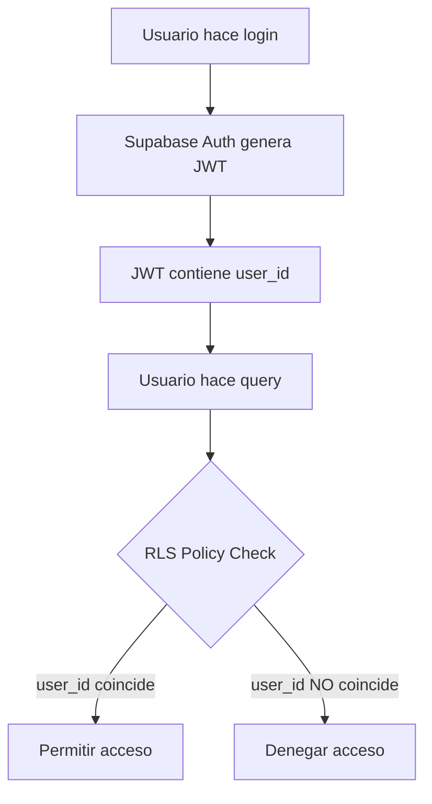

# Políticas de Row Level Security (RLS) para Supabase

Este archivo contiene las políticas SQL necesarias para configurar la seguridad a nivel de fila en Supabase.

## Instrucciones de Implementación

1. Ve al Panel de Supabase → SQL Editor
2. Copia y ejecuta cada bloque de SQL según corresponda
3. Verifica que RLS esté habilitado para cada tabla

---

## 1. Habilitar RLS en todas las tablas

```sql
-- Habilitar RLS en las tablas principales
ALTER TABLE "Prescription" ENABLE ROW LEVEL SECURITY;
ALTER TABLE "PrescriptionProducts" ENABLE ROW LEVEL SECURITY;
ALTER TABLE "DiseaseType" ENABLE ROW LEVEL SECURITY;
ALTER TABLE "Products" ENABLE ROW LEVEL SECURITY;
```

---

## 2. Políticas para la tabla `Prescription`

### Política de SELECT (Lectura)
Los usuarios solo pueden ver sus propias prescripciones.

```sql
CREATE POLICY "Users can view their own prescriptions"
ON "Prescription"
FOR SELECT
USING (auth.uid()::text = user_id);
```

### Política de INSERT (Creación)
Los usuarios solo pueden crear prescripciones para sí mismos.

```sql
CREATE POLICY "Users can create their own prescriptions"
ON "Prescription"
FOR INSERT
WITH CHECK (auth.uid()::text = user_id);
```

### Política de UPDATE (Actualización)
Los usuarios solo pueden actualizar sus propias prescripciones.

```sql
CREATE POLICY "Users can update their own prescriptions"
ON "Prescription"
FOR UPDATE
USING (auth.uid()::text = user_id)
WITH CHECK (auth.uid()::text = user_id);
```

### Política de DELETE (Eliminación)
Los usuarios solo pueden eliminar sus propias prescripciones.

```sql
CREATE POLICY "Users can delete their own prescriptions"
ON "Prescription"
FOR DELETE
USING (auth.uid()::text = user_id);
```

---

## 3. Políticas para la tabla `PrescriptionProducts`

### Política de SELECT (Lectura)
Los usuarios solo pueden ver productos de sus propias prescripciones.

```sql
CREATE POLICY "Users can view products of their own prescriptions"
ON "PrescriptionProducts"
FOR SELECT
USING (
  EXISTS (
    SELECT 1 FROM "Prescription"
    WHERE "Prescription".id = "PrescriptionProducts".prescription_id
    AND "Prescription".user_id = auth.uid()::text
  )
);
```

### Política de INSERT (Creación)
Los usuarios solo pueden agregar productos a sus propias prescripciones.

```sql
CREATE POLICY "Users can add products to their own prescriptions"
ON "PrescriptionProducts"
FOR INSERT
WITH CHECK (
  EXISTS (
    SELECT 1 FROM "Prescription"
    WHERE "Prescription".id = "PrescriptionProducts".prescription_id
    AND "Prescription".user_id = auth.uid()::text
  )
);
```

### Política de UPDATE (Actualización)
Los usuarios solo pueden actualizar productos de sus propias prescripciones.

```sql
CREATE POLICY "Users can update products of their own prescriptions"
ON "PrescriptionProducts"
FOR UPDATE
USING (
  EXISTS (
    SELECT 1 FROM "Prescription"
    WHERE "Prescription".id = "PrescriptionProducts".prescription_id
    AND "Prescription".user_id = auth.uid()::text
  )
)
WITH CHECK (
  EXISTS (
    SELECT 1 FROM "Prescription"
    WHERE "Prescription".id = "PrescriptionProducts".prescription_id
    AND "Prescription".user_id = auth.uid()::text
  )
);
```

### Política de DELETE (Eliminación)
Los usuarios solo pueden eliminar productos de sus propias prescripciones.

```sql
CREATE POLICY "Users can delete products of their own prescriptions"
ON "PrescriptionProducts"
FOR DELETE
USING (
  EXISTS (
    SELECT 1 FROM "Prescription"
    WHERE "Prescription".id = "PrescriptionProducts".prescription_id
    AND "Prescription".user_id = auth.uid()::text
  )
);
```

---

## 4. Políticas para tablas de catálogo (DiseaseType y Products)

Estas tablas son de solo lectura para todos los usuarios autenticados.

### DiseaseType - Lectura pública para usuarios autenticados

```sql
CREATE POLICY "Authenticated users can view disease types"
ON "DiseaseType"
FOR SELECT
TO authenticated
USING (true);
```

### Products - Lectura pública para usuarios autenticados

```sql
CREATE POLICY "Authenticated users can view products"
ON "Products"
FOR SELECT
TO authenticated
USING (true);
```

---

## 5. Verificar las políticas

Para verificar que las políticas se aplicaron correctamente:

```sql
-- Ver todas las políticas de Prescription
SELECT * FROM pg_policies WHERE tablename = 'Prescription';

-- Ver todas las políticas de PrescriptionProducts
SELECT * FROM pg_policies WHERE tablename = 'PrescriptionProducts';

-- Ver todas las políticas de DiseaseType
SELECT * FROM pg_policies WHERE tablename = 'DiseaseType';

-- Ver todas las políticas de Products
SELECT * FROM pg_policies WHERE tablename = 'Products';
```

---

## 6. Políticas adicionales (Opcional)

### Permitir que administradores vean todas las prescripciones

Si necesitas un rol de administrador, primero crea una columna `role` en `auth.users`:

```sql
-- Agregar columna de rol en metadata de usuario
-- Esto se hace en el perfil de usuario o en una tabla personalizada

-- Política de administrador para Prescription
CREATE POLICY "Admins can view all prescriptions"
ON "Prescription"
FOR SELECT
USING (
  auth.jwt() -> 'user_metadata' ->> 'role' = 'admin'
);

-- Política de administrador para PrescriptionProducts
CREATE POLICY "Admins can view all prescription products"
ON "PrescriptionProducts"
FOR SELECT
USING (
  auth.jwt() -> 'user_metadata' ->> 'role' = 'admin'
);
```

---

## 7. Eliminar políticas (si necesitas empezar de nuevo)

```sql
-- Eliminar todas las políticas de Prescription
DROP POLICY IF EXISTS "Users can view their own prescriptions" ON "Prescription";
DROP POLICY IF EXISTS "Users can create their own prescriptions" ON "Prescription";
DROP POLICY IF EXISTS "Users can update their own prescriptions" ON "Prescription";
DROP POLICY IF EXISTS "Users can delete their own prescriptions" ON "Prescription";

-- Eliminar todas las políticas de PrescriptionProducts
DROP POLICY IF EXISTS "Users can view products of their own prescriptions" ON "PrescriptionProducts";
DROP POLICY IF EXISTS "Users can add products to their own prescriptions" ON "PrescriptionProducts";
DROP POLICY IF EXISTS "Users can update products of their own prescriptions" ON "PrescriptionProducts";
DROP POLICY IF EXISTS "Users can delete products of their own prescriptions" ON "PrescriptionProducts";

-- Eliminar políticas de catálogos
DROP POLICY IF EXISTS "Authenticated users can view disease types" ON "DiseaseType";
DROP POLICY IF EXISTS "Authenticated users can view products" ON "Products";
```

---

## Notas Importantes

1. **Autenticación obligatoria**: Con estas políticas, los usuarios DEBEN estar autenticados para acceder a los datos.

2. **user_id como TEXT**: Las políticas usan `auth.uid()::text` porque el campo `user_id` en `Prescription` está como TEXT. Si usas UUID, ajusta las políticas:
   ```sql
   -- Si user_id es UUID
   USING (auth.uid() = user_id)
   ```

3. **Testing**: Después de aplicar las políticas, prueba:
   - Crear una prescripción
   - Ver solo tus prescripciones
   - Intentar acceder a prescripciones de otro usuario (debe fallar)

4. **Logs**: Monitorea los logs de Supabase para detectar violaciones de políticas:
   ```
   Supabase Dashboard → Logs → Postgres Logs
   ```

5. **Performance**: Si tienes muchas prescripciones, considera agregar índices:
   ```sql
   CREATE INDEX idx_prescription_user_id ON "Prescription"(user_id);
   CREATE INDEX idx_prescription_products_prescription_id ON "PrescriptionProducts"(prescription_id);
   ```

---

## Flujo de Seguridad Completo



---

## Testing en el Frontend

Cuando implementes el frontend, verifica:

1. ✅ Solo ves tus propias prescripciones
2. ✅ Puedes crear nuevas prescripciones
3. ✅ No puedes ver/editar prescripciones de otros usuarios
4. ✅ Los catálogos (DiseaseType, Products) son visibles para todos

```typescript
// Ejemplo de prueba
const { data, error } = await supabase
  .from('Prescription')
  .select('*');

console.log('Mis prescripciones:', data);
// Debe devolver solo las prescripciones del usuario autenticado
```
